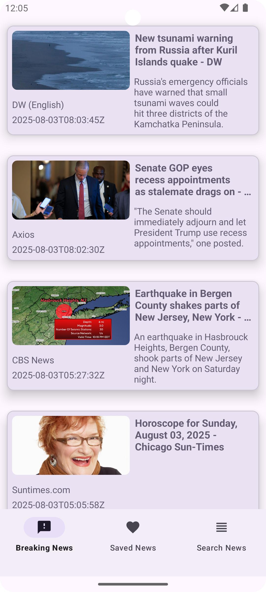

# News App

![App Banner]




A modern Android News Application built with **Kotlin**, **MVVM**, **Paging 3**, and **Retrofit**.  
This app fetches the latest news from a public API and provides an easy-to-use interface for browsing, searching, and saving articles.

---

## Features
- **Breaking News** – Get the latest top headlines.
- **Search News** – Search for articles by keywords.
- **Saved News** – Save your favorite articles for later reading.
- **Paging 3** – Smooth infinite scrolling for articles.
- **Modern UI** – Material Design 3 with a clean interface.

---

## Tech Stack
- **Language**: Kotlin  
- **Architecture**: MVVM (Model-View-ViewModel)  
- **Networking**: Retrofit  
- **Pagination**: Paging 3  
- **Local Storage**: Room Database  
- **Image Loading**: Glide  
- **UI**: Material Design 3 Components  

---

## Setup & Installation
1. Clone this repository:
   ```bash
   git clone https://github.com/hamo3d/news-app.git
